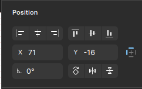
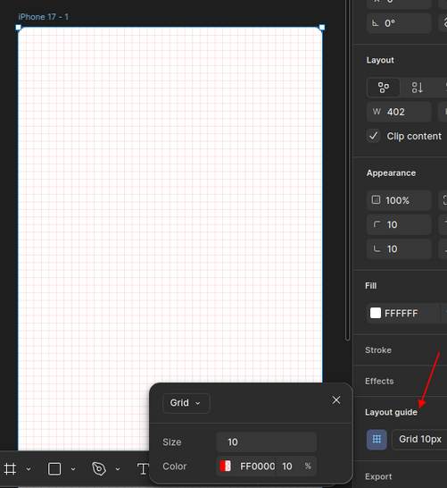
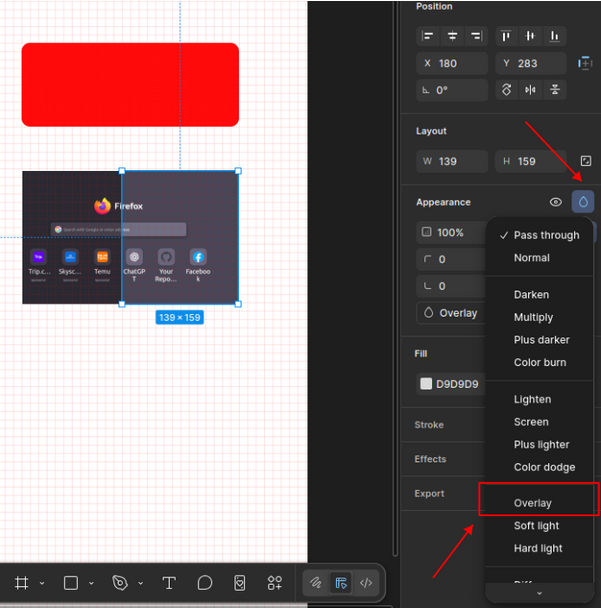

## 1. Figma Shortcuts & Basic Actions

### 1. Zoom

- Zoom in: Ctrl + hoặc Ctrl + Scroll
- Zoom out: Ctrl -

### 2. Move / Scale / Hand Tool

#### 2.1 Move Tool (V)

- Dùng để di chuyển object
- Resize không giữ tỉ lệ

#### 2.2 Scale Tool (K)

    - Dùng để resize giữ tỉ lệ
    - Phù hợp khi scale icon, UI

#### 2.3 Hand Tool (H)

    - Dùng để di chuyển canvas
    - Không làm lệch layout

### 3. Frame

- Ấn `phím F` để mở

### 4. Chỉnh thuộc tính

#### 4.1 Xoay góc

#### 4.2 Bo góc

#### 4.3 Layout Guide

- bật lên để dễ vẽ

#### 4.4 Hòa trộn màu

- Muốn hòa trộn màu thì chọn màu cần hòa trộn ở `Fill`
- chọn hình Giọt nước ở Appearance -> Overlay/...

#### 4.5 Cắt giao diện

- Chức năng này giúp cắt giao diện thành các ảnh khi Export
