

1. TOC
{:toc}

## 1. Figma Shortcuts & Basic Actions

### 1. Zoom

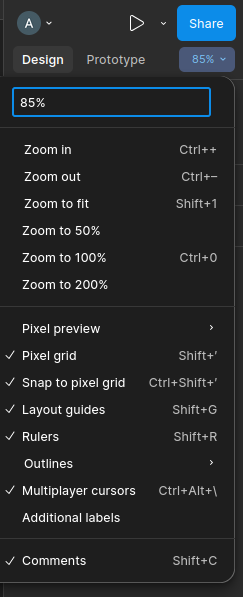

- Zoom in: Ctrl + hoặc Ctrl + Scroll
- Zoom out: Ctrl -
- Zoom một shape/frame/chi tiết nào đó: ấn giữ phím Z và chọn vào vật thể muốn zoom

### 2. Move / Scale / Hand Tool

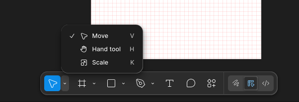

#### 2.1 Move Tool (V)

- Dùng để di chuyển object
- Resize không giữ tỉ lệ

#### 2.2 Scale Tool (K)

    - Dùng để resize giữ tỉ lệ
    - Phù hợp khi scale icon, UI

#### 2.3 Hand Tool (H)

    - Dùng để di chuyển canvas
    - Không làm lệch layout

### 3. Frame

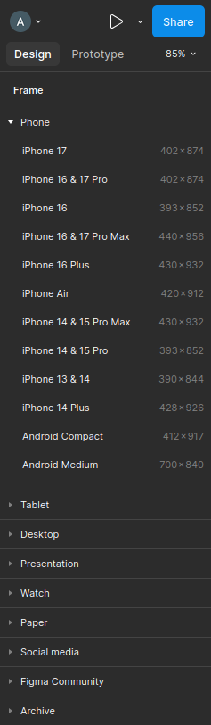

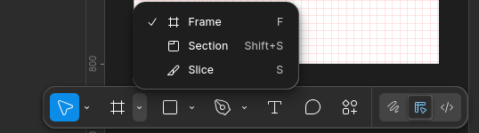

- Ấn `phím F` để mở, hoặc thanh menu bên dưới website

### 4. Chỉnh thuộc tính

#### 4.1 Xoay góc

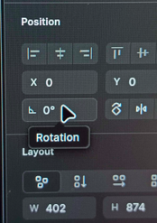

#### 4.2 Bo góc

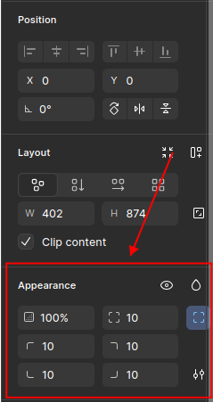

#### 4.3 Layout Guide

- bật lên để dễ vẽ

#### 4.4 Hòa trộn màu

- Muốn hòa trộn màu thì chọn màu cần hòa trộn ở `Fill`
- chọn hình `Giọt nước` ở `Appearance` -> `Overlay/...`

#### 4.5 Cắt giao diện

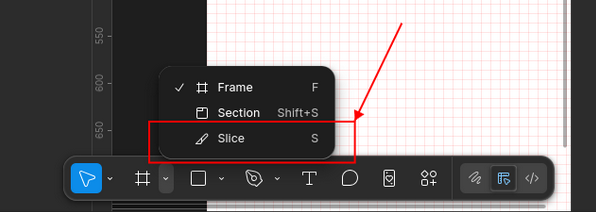

- Chức năng này giúp cắt giao diện thành các ảnh khi `Export`

### 5. Shape

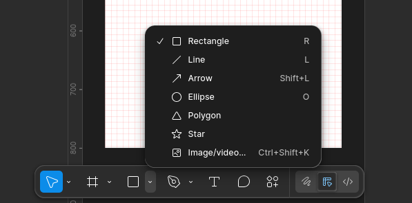

- `Image/video...(Ctrl + Shift + K)`: dùng để thêm ảnh/video

- Chọn hình elip/hình chữ nhật/hình tam giác/... -> sau đó thêm ảnh

- Đổ màu vào ảnh: chọn shape -> thêm ảnh vào shape -> vẽ shape khác trên ảnh -> chọn `Fill` (màu để đổ vào ảnh) -> chọn các chế độ `overlay/multiply/...` (trong `Giọt nước` ở `Appearance`)

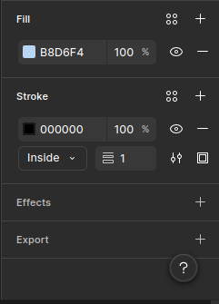

- Viền khung: `stroke`

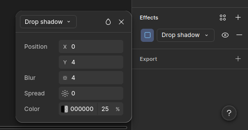

- Đổ bóng: `Effect`

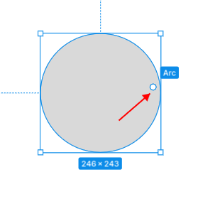

- Nút chấm đó để vẽ hình tròn khuyết

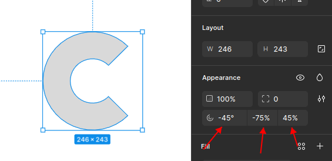

- Cách tạo ra chữ C, nếu như chèn ảnh vào chữ C kia sẽ tạo hiệu ứng khá thú vị

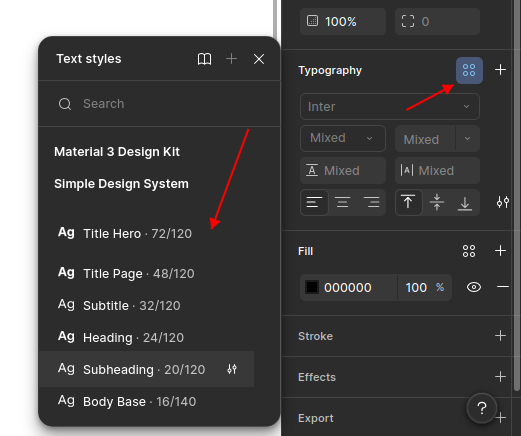

- Cách chỉnh text thành heading/body/...

### 6. Component

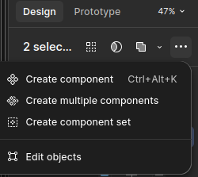

- Nên dùng khi: phần tử cần tái sử dụng nhiều lần (button, input field, icons, header/footer, card), thiết kế hệ thống đồng bộ (giúp thay đổi một lần ở Main Component toàn bộ instance trên các màn hình khác nhau sẽ tự cập nhật theo), làm việc nhóm (dễ dàng chia sẻ thư viên component/library cho các designer khác), prototype (cần tạo các tương tác phức tạp như: hover, click chuyển trạng thái)

- Chỉnh sửa ở con thì cha không thay đổi, chỉnh sửa ở cha thì tất cả con sẽ thay đổi. Nếu con thay đổi rồi, quay lại đổi cha thì con mới sửa không thay đổi theo cha nữa.

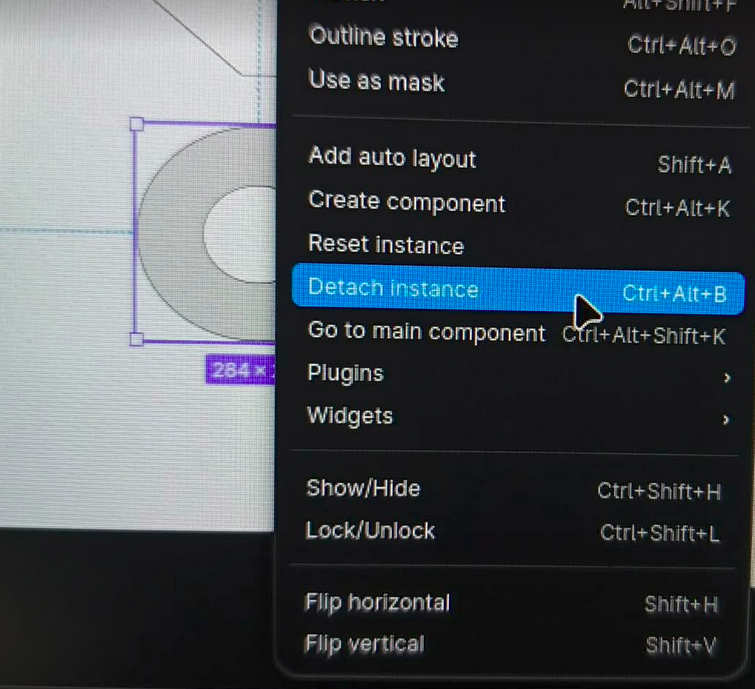

- Để hủy component thì chọn component, chuột phải chọn detach instance. Lưu ý chỉ dùng được với component con

- Nếu dùng `auto layout` với component thì nó chỉnh sửa cho tất cả các component

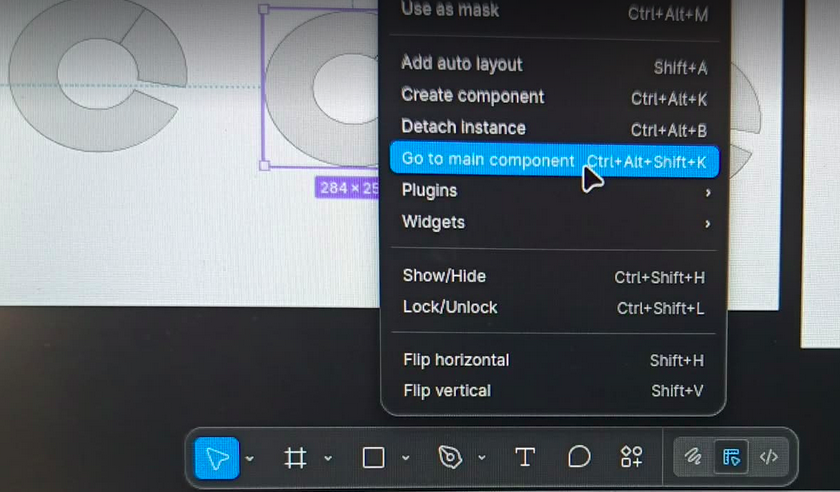

- Khi có quá nhiều component, cách để tìm component cha: chọn component -> chọn go to main component.

- Muốn tạo màu dễ dàng, thì đặt tên màu để dễ chọn

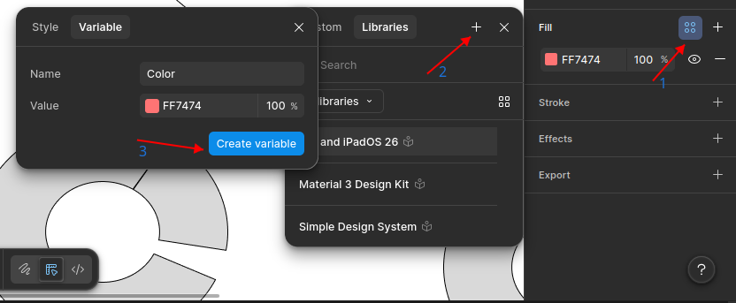

- Tạo color style với màu mới

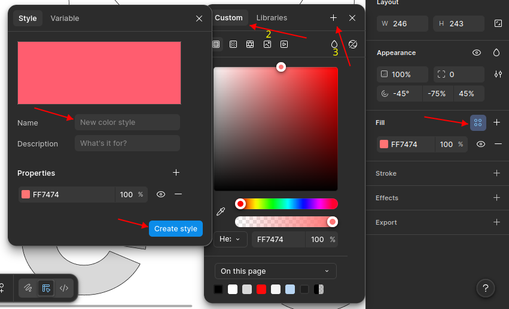

- Tạo color style với màu cũ đã có

- Muốn tạo style text áp dụng nhiều chỗ, dễ dùng lại thì tạo text style

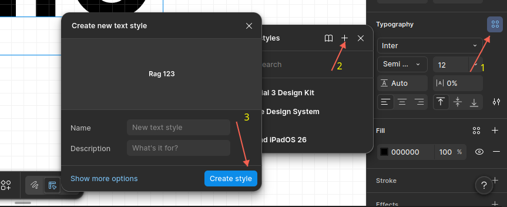

- Tạo text style mới

### 7. Constraint

- Giúp vị trí không thay đổi dù resize shape (căn lề ấy)

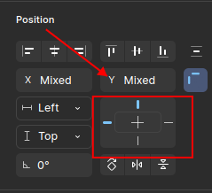
