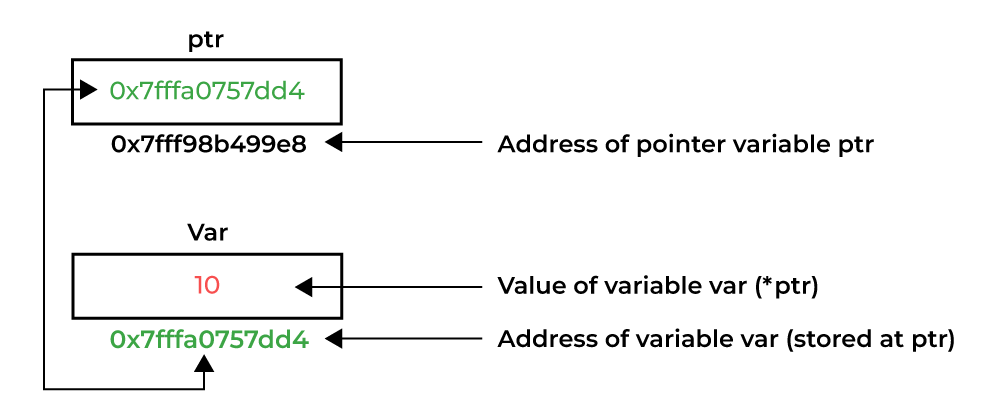

# C

## Pointer



> Vì sao C cần **pointer**?  
> Pointer tồn tại vì C muốn cho lập trình viên kiểm soát bộ nhớ một cách trực tiếp và hiệu quả.

```sh

Tên biến  →  Giá trị
Pointer   →  Địa chỉ
*pointer  →  Giá trị tại địa chỉ
&biến     →  Địa chỉ của biến

```

> Pointer là *biến lưu địa chỉ bộ nhớ*, cho phép chương trình **truy cập** và **thay đổi trực tiếp** dữ liệu trong RAM, từ đó giúp C đạt hiệu năng cao và làm việc sát hệ thống.

1. Pointer + malloc/free (heap vs stack)

- stack:

    - tự động cấp phát
    - nhanh
    - hết scope là biến chết
    - kích thước nhỏ

    ```c
    void foo() {
        int x = 10;   // stack
    }

    // ra khỏi foo() thì x không còn tồn tại nữa

    ```

- heap:

    - cấp phát thủ công
    - sống cho đến khi **free**
    - dùng cho dữ liệu lớn/sống lâu

    ```c
    int *p = malloc(sizeof(int));

    // OS chỉ trả về địa chỉ -> phải dùng pointer

    // thứ tự thực hiện:

    // CPU thực hiện:
    // 1. Xin OS sizeof(int) bytes trên heap
    // 2. OS trả về địa chỉ, ví dụ 0x5000
    // 3. Gán địa chỉ đó cho p

    // STACK              HEAP
    // p → 0x5000   --->  [ ???? ]
 
    // KL: malloc KHÔNG gán giá trị, Heap ban đầu là rác

    *p = 10; // Ghi dữ liệu vào heap qua pointer

    // STACK              HEAP
    // p → 0x5000   --->  [ 10 ]

    // KL: Pointer là cầu nối duy nhất giữa stack và heap

    free(p); 

    // Trả vùng nhớ cho OS
    // KHÔNG xóa pointer
    // p vẫn giữ địa chỉ cũ → ❌ nguy hiểm

    // cách đúng là:

    free(p);
    p = NULL;

    // -> quên free sẽ bị memory leak
    ```

```c
// Lỗi trả stack ra ngoài

int* foo() {
    int x = 10;
    return &x; // ❌
}

int *p = foo();

// trong RAM: foo kết thúc → x bị hủy, p trỏ vào vùng nhớ "ma"

```

> KL:  
> - malloc **cấp phát bộ nhớ** trên heap và trả về địa chỉ vùng nhớ đó, pointer được dùng để **lưu địa chỉ** này nhằm truy cập và quản lý vòng đời dữ liệu, trong khi free giải phóng bộ nhớ để tránh memory leak.  
> - Sau khi *free*, pointer trở thành **dangling pointer** vì nó vẫn giữ địa chỉ cũ nhưng vùng nhớ đã không còn hợp lệ, việc dereference sẽ gây undefined behavior.

2. Pointer + struct

- struct lưu trong RAM như nào?

```c
struct Point {
    int x;
    int y;
};

struct Point p = {1, 2};

// Địa chỉ      Giá trị
// 0x1000  →    1   ← p.x
// 0x1004  →    2   ← p.y

//  -> p là struct, chứa dữ liệu trực tiếp.

p.x = 10;
p.y = 20;

// truy cập thường dùng `.`, nếu struct nằm trực tiếp, không phải pointer

struct Point *ptr = &p; // pointer tới struct

// STACK
// ptr → 0x1000

// HEAP / STACK
// 0x1000 → 1  (x)
// 0x1004 → 2  (y)

ptr->x = 10; // tương đương (*ptr).x = 10;

// 📌 -> = dereference + truy cập field

```

- KL: Khi làm việc với struct, toán tử `->` được dùng khi có pointer tới struct, nó tương đương với `(*ptr).field`, giúp truy cập thành viên thông qua địa chỉ mà pointer trỏ tới.

3. Pointer lỗi kinh điển fresher hay dính

4. So sánh pointer C và reference C++

## memory

## struct

## Bitwise (& | ^ << >>)  
